# kubernetis-dz05
«Хранение в K8s»


### Дополнительные материалы, которые пригодятся для выполнения задания
1. [Описание Volumes](https://kubernetes.io/docs/concepts/storage/volumes/).
2. [Описание Ephemeral Volumes](https://kubernetes.io/docs/concepts/storage/volumes/).
3. [Описание PersistentVolume](https://kubernetes.io/docs/concepts/storage/persistent-volumes/).
4. [Описание PersistentVolumeClaim](https://kubernetes.io/docs/concepts/storage/persistent-volumes/#persistentvolumeclaims).
5. [Описание StorageClass](https://kubernetes.io/docs/concepts/storage/storage-classes/).
6. [Описание Multitool](https://github.com/wbitt/Network-MultiTool).

------

## Задание 1. Volume: обмен данными между контейнерами в поде
### Задача

Создать Deployment приложения, состоящего из двух контейнеров, обменивающихся данными.

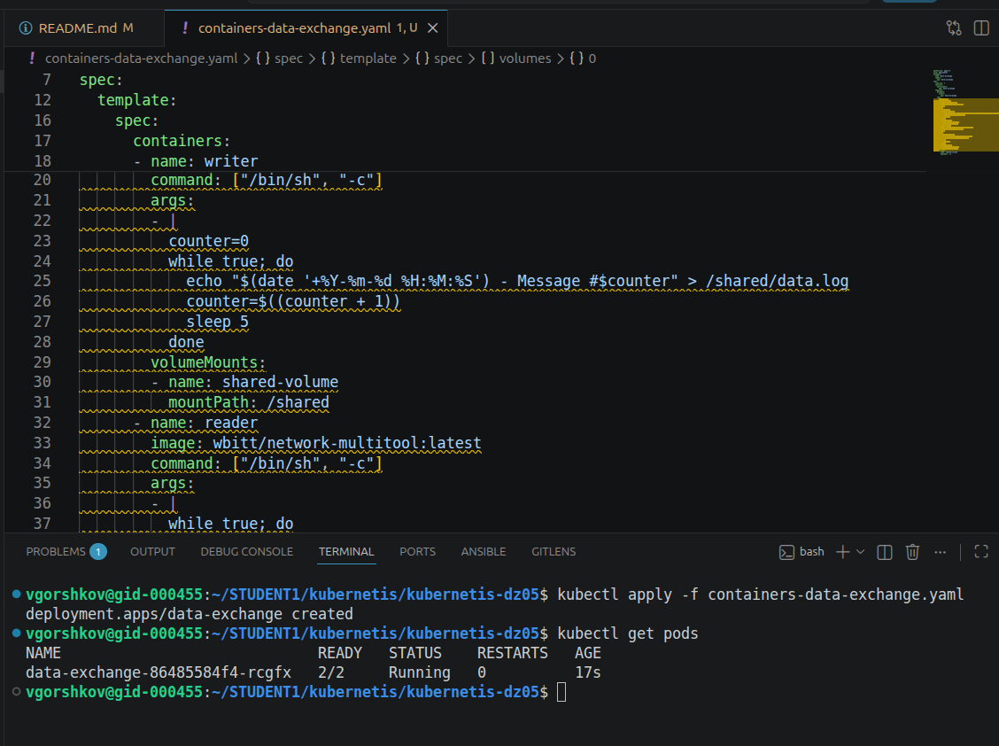

### Шаги выполнения
1. Создать Deployment приложения, состоящего из контейнеров busybox и multitool.
Writer и Reader  это как раз контейнеры busybox и multitool соответственно.
2. Настроить busybox на запись данных каждые 5 секунд в некий файл в общей директории.
3. Обеспечить возможность чтения файла контейнером multitool.

Исследуем под:
kubectl describe pods data-exchange

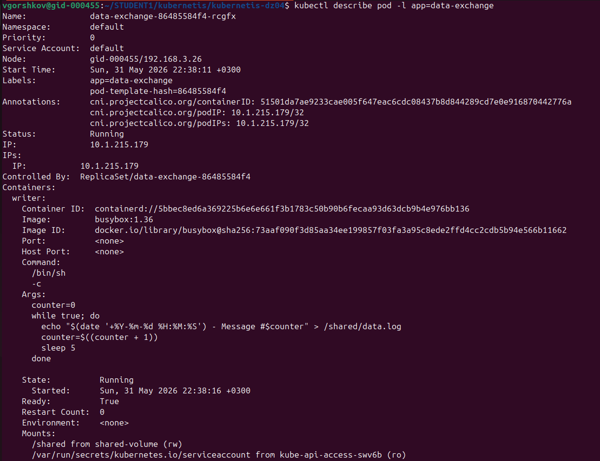
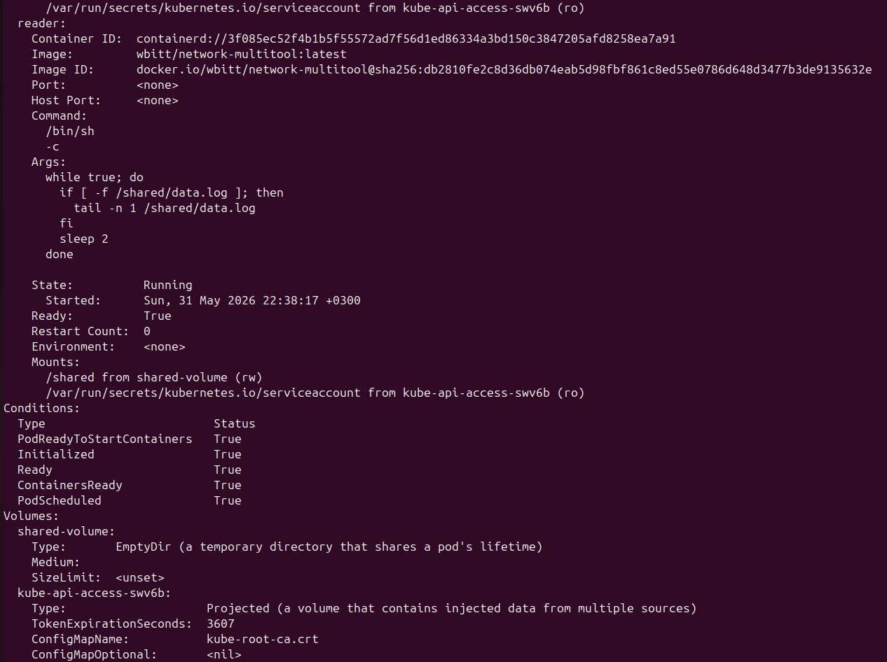
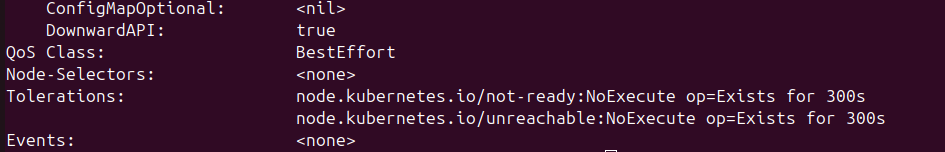

Получили UID  пода
```
kubectl get pod -l app=data-exchange -o jsonpath='{.items[0].metadata.uid}'
24f5b7dc-8ca1-48db-bb60-362264e0ee59
```
Видим рабочие директории
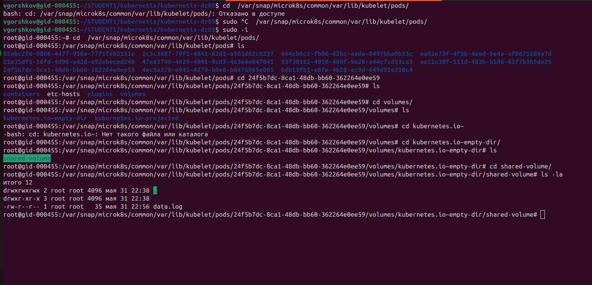

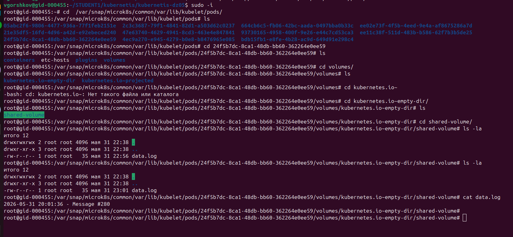


### Что сдать на проверку
- Манифесты:
  - `containers-data-exchange.yaml`
- Скриншоты:
  - описание пода с контейнерами (`kubectl describe pods data-exchange`)
  - вывод команды чтения файла (`tail -f <имя общего файла>`)

------

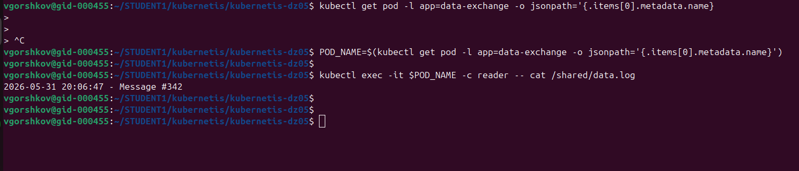

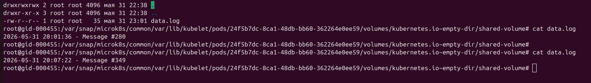

Видим запись в файл и его обновление как внутри reader так и на хосте в самом pode


## Задание 2. PV, PVC
### Задача
Создать Deployment приложения, использующего локальный PV, созданный вручную.

### Шаги выполнения
1. Создать Deployment приложения, состоящего из контейнеров busybox и multitool, использующего созданный ранее PVC

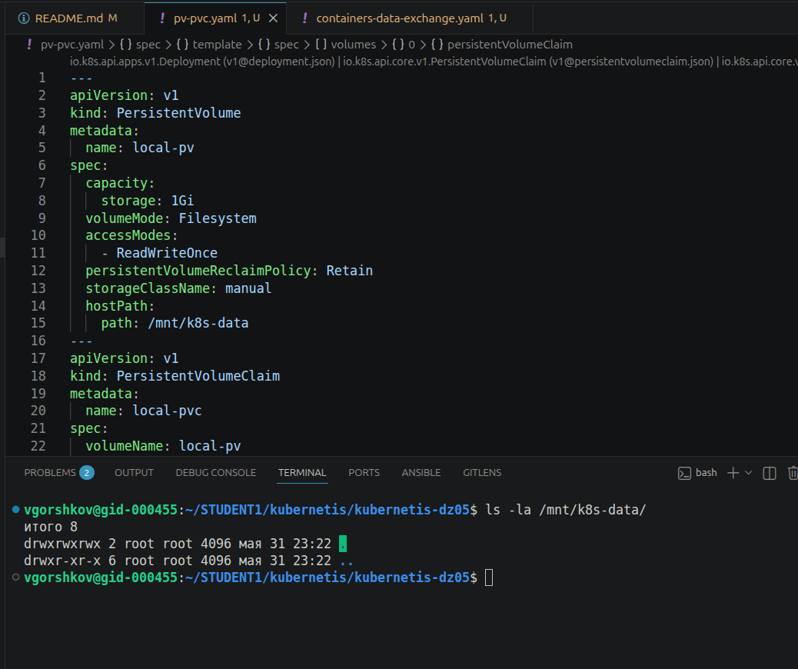

2. Создать PV и PVC для подключения папки на локальной ноде, которая будет использована в поде.

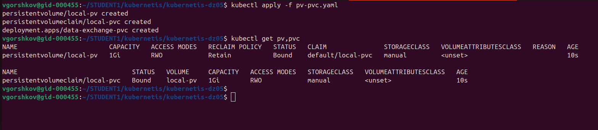

3. Продемонстрировать, что контейнер multitool может читать данные из файла в смонтированной директории, в который busybox записывает данные каждые 5 секунд. 

узнаем имя пода
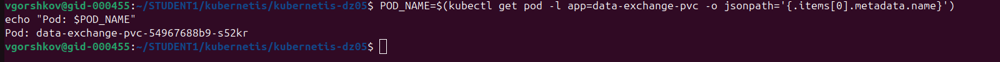

видим обновление данных
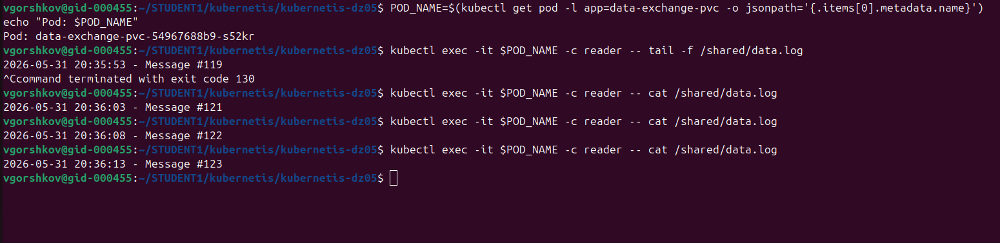

4. Удалить Deployment и PVC. Продемонстрировать, что после этого произошло с PV. Пояснить, почему. (Используйте команду `kubectl describe pv`).

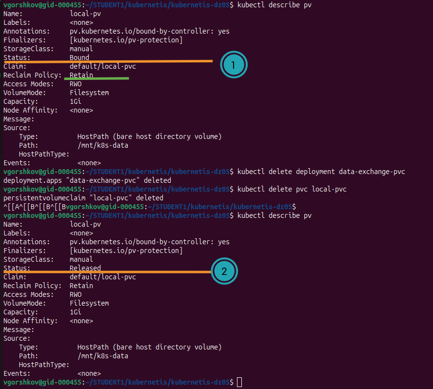

 Ответ:  
   После удаления PVC статус PV изменился на Released, потому что в манифесте указана политика возврата persistentVolumeReclaimPolicy = Retain. K8s сохраняет данные и сам объект PersistentVolume после удаления, чтобы администратор мог вручную решить, что делать с данными, они не удаляются автоматически вместе с PVC.


5. Продемонстрировать, что файл сохранился на локальном диске ноды. Удалить PV.  Продемонстрировать, что произошло с файлом после удаления PV. Пояснить, почему.

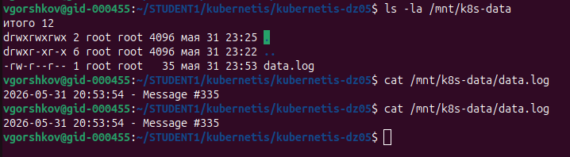

 Ответ:
    После удаления PV файл data.log остался на файловой системе ноды в папке, так как при использовании типа hostPath, K8s управляет объектами (PV, PVC), и не контролирует физическую файловую систему хоста. Удаление метаданных PV из API кластера не приводит к автоматическому удалению файлов на диске. Данные сохраняются до тех пор, пока администратор не очистит директорию вручную. Это важно учитывать при использовании hostPath в production: очистка выполняется ручками.

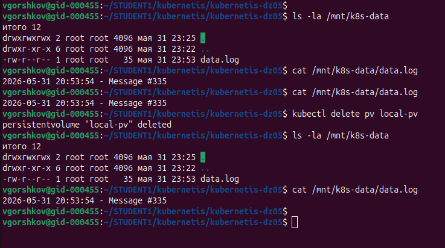


------

## Задание 3. StorageClass
### Задача
Создать Deployment приложения, использующего PVC, созданный на основе StorageClass.

### Шаги выполнения

1. Создать Deployment приложения, состоящего из контейнеров busybox и multitool, использующего созданный ранее PVC.

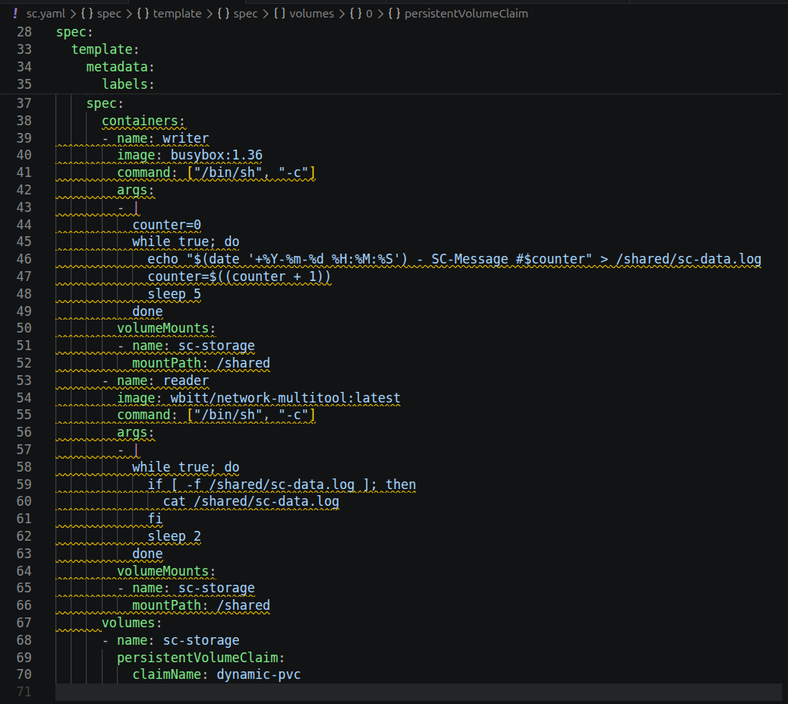

2. Создать SC и PVC для подключения папки на локальной ноде, которая будет использована в поде.

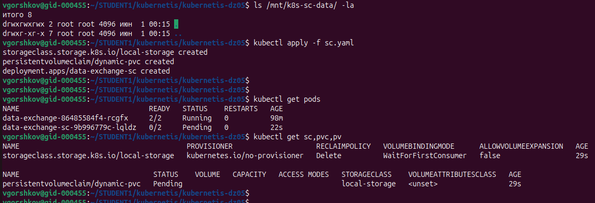

Проверяем, и видим что  kubernetes.io/no-provisioner, Kubernetes не создаст PV автоматически. PVC dynamic-pvc в статусе Pending, добавим блок PersistentVolume.
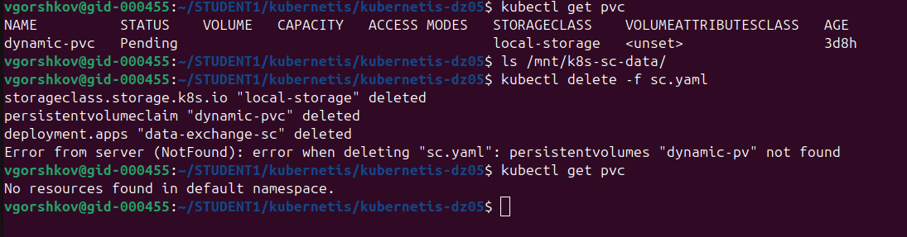

[text](sc.yaml)

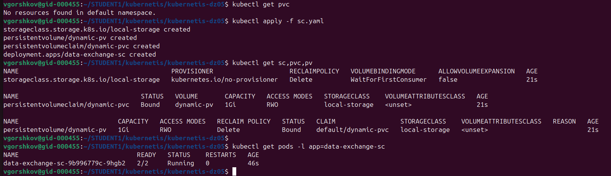

3. Продемонстрировать, что контейнер multitool может читать данные из файла в смонтированной директории, в который busybox записывает данные каждые 5 секунд.

все ресурсы созданы и работают 
STATUS = Bound
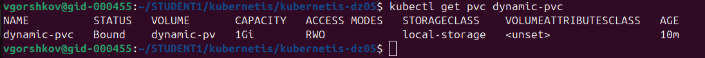 

READY = 2/2, STATUS = Running
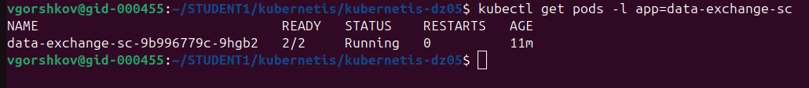

Имя пода: data-exchange-sc-9b996779c-9hgb2
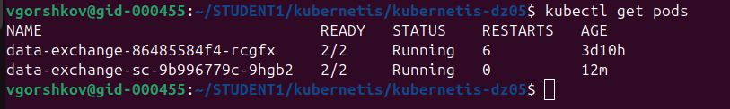

Читаем файл из контейнера reader (multitool):
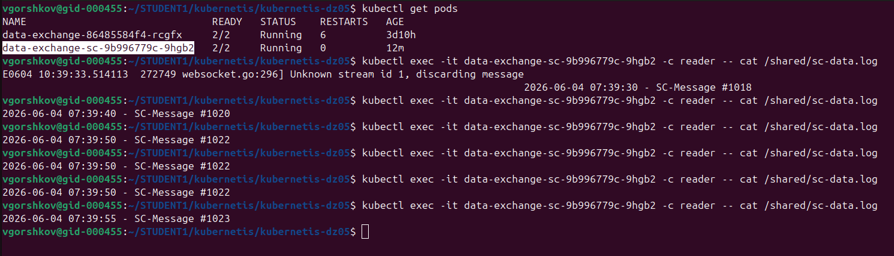

Проверим файл на хосте:
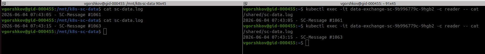


